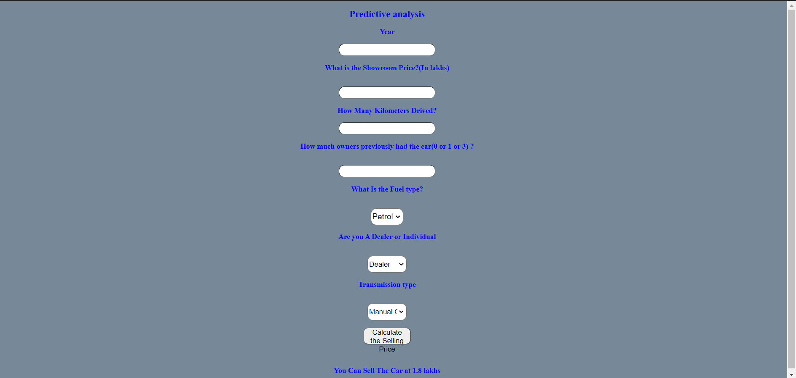

# Car-Price-Prediction
## Table of Contents
* [About the project](#about-the-project)
* [About the dataset](#about-the-dataset)
* [Tech Stack used](#tech-stack-used)
* [Install and Run](#install-and-run)

## About the Project
It predicts the selling price of a car given various parameters like 
year,
selling_price,
km_driven,
fuel,
seller_type,
transmission,
Owner

## About the dataset:

Vehicle dataset [https://www.kaggle.com/nehalbirla/vehicle-dataset-from-cardekho]

This dataset contains information about used cars listed on www.cardekho.com
This data can be used for a lot of purposes such as price prediction to exemplify the use of linear regression in Machine Learning.
The columns in the given dataset are as follows:

name,
year,
selling_price,
km_driven,
fuel,
seller_type,
transmission,
Owner

## Prediction 


## Tech Stack used 
Project is created with :
HTML, CSS, Flask, Python, Machine Learning.

## Install and Run

1. Clone the repo
  ```
  $ git clone https://github.com/TanmayThaker/Car-Price-Prediction
  $ cd Car-Price-Prediction
  ```

2. Initialize and activate a virtualenv:
  ```
  $ virtualenv --no-site-packages env
  $ source env/bin/activate
  ```

3. Install the dependencies:
  ```
  $ pip install -r requirements.txt
  ```

5. Run the development server:
  ```
  $ python app.py
  ```

6. Navigate to [http://localhost:8000](http://localhost:8000)
